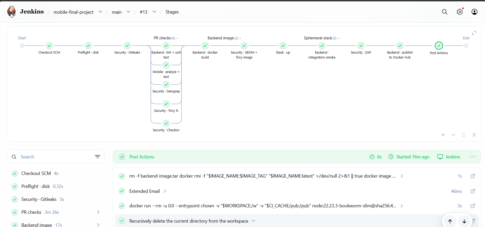
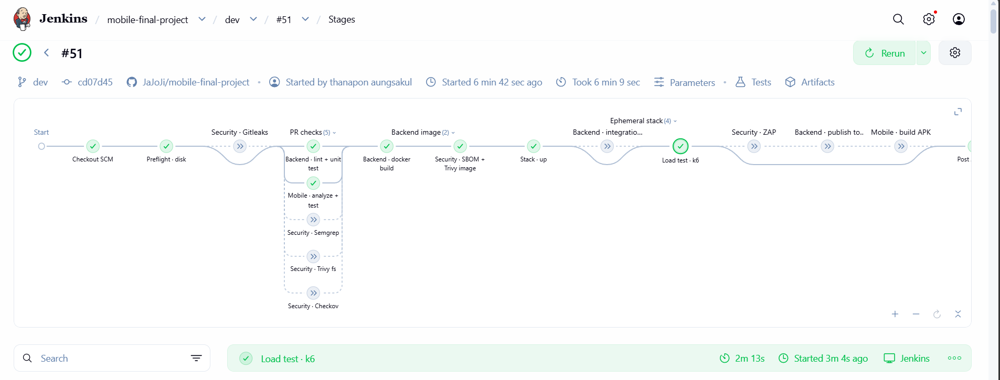
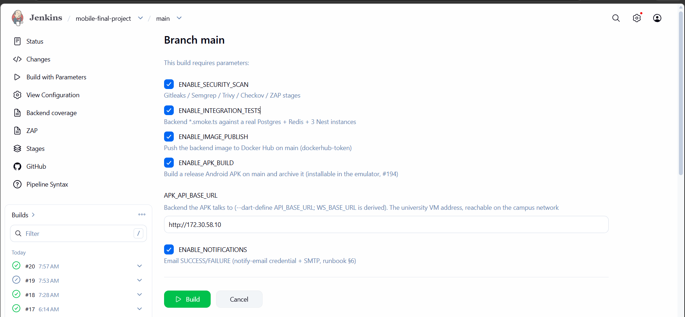
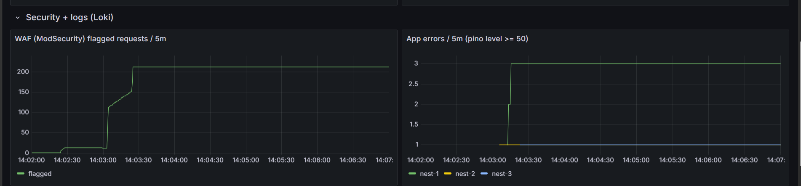
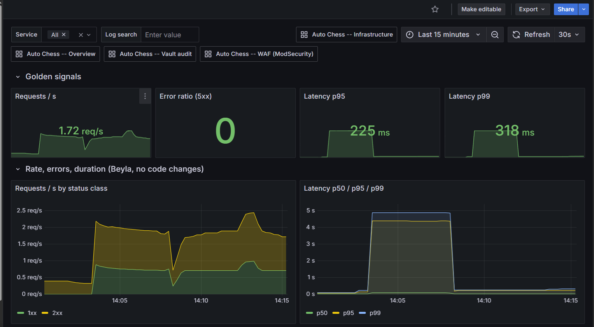
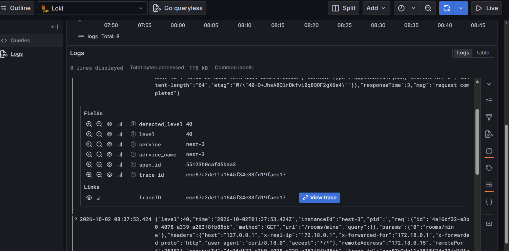
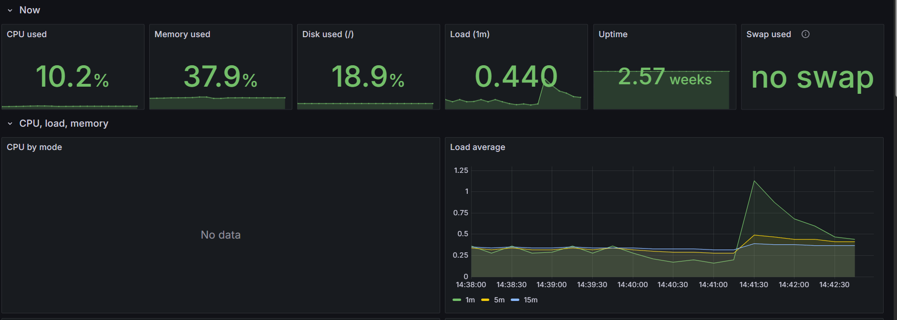

# รายงาน DevOps — Auto Chess Mobile

สรุปงาน DevOps ทั้งหมดของโปรเจกต์ (CI/CD, ความปลอดภัย, โครงสร้างพื้นฐาน, การเฝ้าระวัง, ผลทดสอบ, ข้อจำกัด)
ทุกตัวเลขในเอกสารนี้มาจาก build / เครื่องจริงที่รันแล้ว ส่วนที่ **ไม่ได้ทดสอบ** ระบุไว้ชัดในหัวข้อ 14

เอกสารที่เกี่ยวข้อง: [runbook.md](runbook.md) (คำสั่งสำหรับ VM) · [docs/08-runbook.md](docs/08-runbook.md) (Jenkins) ·
[docs/14-gate-evidence.md](docs/14-gate-evidence.md) (หลักฐานแต่ละ gate) · [infra/README.md](infra/README.md)

ภาพหลักฐานที่ใช้ในรายงานอยู่ที่ [report-assets/](report-assets/) (เลือกเฉพาะภาพที่เป็นหลักฐานจริง 7 ภาพ)

---

## ก. สรุปสั้น (อ่านแค่นี้ก็พอ)

- **ทำครบ pipeline หลัก:** Jenkins ตัวเดียว ตรวจ secret → ตรวจโค้ด/สแกน (ขนาน) → build image → SBOM + สแกน image →
  stack ชั่วคราว (smoke + ZAP + k6) → publish จาก tar เดียวกับที่สแกน → APK; VM มหาวิทยาลัยดึงไป deploy เอง มี rollback อัตโนมัติ
- **ความปลอดภัย 6 ชั้น:** Gitleaks, Semgrep, Trivy, Checkov, ZAP, SBOM + Vault (secret) + ModSecurity (WAF, ยัง log อย่างเดียว)
- **มองเห็นระบบ:** Grafana 5 dashboard, metrics/logs/traces เชื่อมกันด้วย `trace_id`
- **วัดผลจริง:** k6 50 แมตช์ (100 ผู้เล่น) p95 ~112–115 ms เทียบเกณฑ์ 500 ms, ผู้เล่นล้มเหลว 0, CPU VM ~10%
- **ที่ยังไม่ได้ทำ/ไม่ได้ทดสอบ (พูดตรงๆ):** reboot และ restore เต็ม, red-proof ของ gate, เซ็น image, เพดานระบบ — ดูหัวข้อ 14

## ข. เทียบกับ DevOps Master Guide

ตรวจจาก `guide/DevOps_Master_Guide.md` (Part A: A1 pipeline 16 stage, A4 นโยบาย fail/warn, A7 Jenkins hardening, A9 ช่องว่าง, เช็คลิสต์ Day 0)
สัญลักษณ์: ✅ ทำแล้ว · ⚠️ ทำบางส่วน/ต่างจาก guide · ❌ ยังไม่ทำ · ➖ ไม่เข้ากับสถาปัตยกรรมเรา

### ข.1 Reference pipeline (A1)

| # | Stage ใน guide | สถานะ | งานของเรา |
|---|---|---|---|
| 0 | Threat model / design review | ❌ | ไม่ได้ทำเป็นเอกสาร |
| 1 | Pre-commit | ⚠️ | มี `.pre-commit-config.yaml` (format/typecheck); hook gitleaks + eslint ยังไม่มี (เก็บไว้ project หน้า) — guide ว่า "แค่แนะนำ" |
| 2 | Server-side push protection | ⚠️ | Gitleaks สแกน **ทั้ง history** ใน CI (บล็อกเสมอ) แต่ไม่ได้ตั้ง push protection ฝั่ง GitHub |
| 3 | PR checks ขนาน | ✅ | Gitleaks, Semgrep, Trivy fs, Checkov, backend, mobile ขนานกัน (สแกนทั้งหมด ไม่ใช่ diff — repo มี 0 finding จึงยังไม่จำเป็น) |
| 4 | Unit + security unit test | ✅ | coverage floor บังคับ (game ≥ 90%) |
| 5 | Build บน agent ชั่วคราว | ✅ | tool container ทิ้งหลังใช้, input ปักด้วย digest |
| 6 | SBOM | ✅ | CycloneDX ของ **image** (ดีกว่าที่ guide บันทึกว่า lab ทำได้) |
| 7 | Scan image **ก่อน push** | ✅ | build → tar → SBOM + Trivy → publish จาก tar เดิม (ปิดช่องว่าง A9 #3 แล้ว) |
| 8 | Push ด้วย digest | ⚠️ | image แอป tag = commit; image โครงสร้างพื้นฐานใน compose ปักด้วย digest |
| 9 | Sign + attest | ❌ | ไม่เซ็น image / ไม่มี attestation |
| 10 | GitOps deploy | ➖ | VM หลัง NAT ใช้ pull-based `auto-chess-deploy` แทน (ไม่มี Kubernetes) |
| 11 | E2E + DAST | ✅ | integration smoke + ZAP baseline/API บน stack ชั่วคราว, `rules.tsv` กำหนด FAIL |
| 12 | Admission policy | ➖ | ไม่มี Kubernetes |
| 13 | Progressive deploy + auto-rollback | ⚠️ | rollback อัตโนมัติเมื่อ `/health/ready` ไม่ผ่าน (ไม่มี canary / วิเคราะห์ metric) |
| 14 | Post-deploy verification | ⚠️ | smoke + `/health/ready`; `/health` ยังไม่คืน version (เก็บไว้ใน #289) |
| 15 | Continuous rescan | ❌ | เก็บไว้ใน #289 |

### ข.2 นโยบาย fail / warn (A4)

| หัวข้อ | สถานะ |
|---|---|
| Secret บล็อกเสมอ | ✅ Gitleaks `--exit-code 1` |
| Image scan `--severity HIGH,CRITICAL --ignore-unfixed --exit-code 1` | ✅ |
| ข้อยกเว้นต้องมีเหตุผล + วันหมดอายุ | ✅ `.trivyignore.yaml` (`statement` + `expired_at`) |
| ZAP: กำหนด FAIL/IGNORE/WARN เอง | ✅ `rules.tsv` |
| Scanner ปักด้วย digest (กัน supply-chain ที่ Trivy เคยโดน) | ✅ ทุกตัว |
| ปัญหา "Trivy คืน 0 ถ้าไม่ใส่ `--exit-code 1`" | ✅ ใส่แล้ว |
| Gate ใหม่เริ่มโหมด warn ก่อน | ⚠️ ZAP/WAF ใช้แนวนี้ (WAF = DetectionOnly); gate อื่นเปิด fail ตั้งแต่ต้น |
| SCA/Licence allowlist, EPSS | ❌ ไม่ได้ทำ (Trivy fs ครอบ CVE; ไม่มีตรวจ licence) |

### ข.3 Jenkins hardening (A7)

| ข้อ | สถานะ |
|---|---|
| controller ไม่รัน build (executor = 0) | ⚠️ **ต่างจาก guide:** build รันบน built-in node (1 executor) เพราะมีเครื่องเดียว 4 GB; ลดความเสี่ยงด้วยการให้ทุก tool รันใน container ที่จำกัดหน่วยความจำ และไม่ให้ scanner เข้าถึง docker.sock |
| patch สม่ำเสมอ | ✅ มีขั้นตอนใน runbook §7 (ไม่ได้ทำให้อัตโนมัติ) |
| ไม่แทน credential ใน Groovy string แบบ double-quote | ✅ stage publish ใช้ `withCredentials` + `sh '''…$VAR…'''` |
| โค้ดที่ไม่น่าเชื่อถือห้ามถึง stage ที่มี credential | ✅ publish / APK มี `not { changeRequest() }` + fork PR เชื่อเฉพาะ Admin/Write |
| Pin plugin | ✅ 97 ตัวใน `plugins.txt` |
| Backup `master.key` + `credentials.xml` | ✅ รายวัน (ทดสอบ restore เต็มยังไม่ได้ทำ) |
| Audit Trail ส่งออก | ❌ |
| Prometheus scrape Jenkins / SLO ของ CI | ❌ เก็บไว้ใน #289 |

### ข.4 ช่องว่าง A9 และเช็คลิสต์ Day 0

- **ปิดแล้ว:** pin image ของ scanner (#1), scan ก่อน push (#3), `gitleaks git` (#5), ZAP (#6), กัน fork PR (#8), pin plugin (#11)
- **ยังเปิด:** เซ็น image (#2), diff-aware Semgrep (#7, ตัดสินใจข้ามเพราะ 0 finding), burn-rate alert (#9), Renovate/rescan (#12)
- **ไม่เข้ากัน:** `docker:dind` / Kubernetes (#4, #10) — เราไม่ใช้ Kubernetes
- Day 0: branch protection **ยังไม่ตั้ง (#280 รอเจ้าของ repo)**, CODEOWNERS ✅, runbook ✅, เช็คดิสก์ ✅ (Preflight),
  Prometheus scrape Jenkins ❌, **"พิสูจน์ว่า gate แดงได้" ❌** (ตัดสินใจไม่ทำ)

**สรุป:** แกนที่ guide เน้น (บล็อก secret เสมอ, scan ก่อน push, pin ทุกอย่าง, DAST, rollback) ทำครบ ส่วนที่ขาดคือชั้น supply-chain ขั้นสูง
(เซ็น/attest, admission) และการวัด (DORA/SLO) — ระดับที่ guide เทียบ DSOMM Level 2 ซึ่งถือว่าเหมาะกับงานนักศึกษา เราทำได้เกือบครบ ยกเว้นบังคับ PR ผ่าน branch protection

## ค. สิ่งที่ควรพูดตอน present ส่วน DevOps

### ค.1 จากการค้นข้อมูล

แหล่งที่ค้นได้ส่วนใหญ่เป็นแนวทางทั่วไป (ไม่มีสคริปต์ของ "การ present โปรเจกต์ DevOps" ที่เป็นทางการ) สิ่งที่ตรงกัน:

1. **เล่าเป็นลำดับ pipeline:** Commit → Build → Test → Release/Deploy → Monitor
2. **โชว์ว่าอัตโนมัติและตรวจได้:** ภาพ pipeline, ผล test/scan, อัตโนมัติแทนการตรวจมือ
3. **ความปลอดภัย:** ครอบคลุม secret scan, SAST, DAST, dependency/container scan และ **SBOM** (ผู้ประเมินมักมองหาการครบชุดนี้และ shift-left)
4. **จัดการ secret ให้ถูกวิธี:** ใช้ Vault หรือเทียบเท่า ไม่ฝังในโค้ด
5. **rollback / กู้คืน:** บอกว่าถ้า deploy พังเกิดอะไรขึ้น
6. **ตัวเลข:** DORA 4 ตัว (deployment frequency, lead time, change failure rate, time to restore) — เราไม่ได้วัด DORA ไว้ จึง **ห้ามอ้างตัวเลข DORA**
   ให้ใช้ตัวเลขที่วัดจริงแทน (ผล k6, เวลา build, coverage, จำนวน component ใน SBOM)
7. **ปัญหาที่เจอและบทเรียน** + **ข้อจำกัดตรงๆ** (ผู้ฟังเชื่อถือมากกว่าอวดว่าสมบูรณ์)

### ค.2 โครงที่แนะนำ (ประมาณ 8–10 นาที)

| นาที | หัวข้อ | พูดอะไร | ภาพ/หลักฐาน |
|---|---|---|---|
| 1 | ทำไมต้องมี DevOps ในโปรเจกต์นี้ | ทีมหลายคนส่งงานเข้า `dev`/`main` เกมออนไลน์ต้องเสถียร ตรวจมือไม่ทัน | – |
| 1 | ภาพรวม toolchain | Jenkins → Docker Hub → VM pull · Ansible · Vault · Grafana stack | แผนภาพหัวข้อ 1 |
| 2 | Pipeline | แต่ละ stage ทำอะไร, ขนานตรงไหน, ทำไมเรียงตามต้นทุน (Gitleaks ถูกสุดไปก่อน) | `01-jenkins-main-13-all-green.png` |
| 1.5 | Security gates | 5 scanner + SBOM + นโยบาย (secret บล็อกเสมอ, ignore ต้องมีวันหมดอายุ) | `03-jenkins-build-with-parameters.png`, SBOM 434 components |
| 1 | Release + rollback | ทำไม pull-based (หลัง NAT), health check, rollback อัตโนมัติ | `deploy.sh` |
| 1 | Secret + WAF | Vault production mode, WAF พบ SQLi rule 942100 (ยังไม่ block) | `06-grafana-waf-dashboard.png` |
| 1.5 | Observability | metrics/logs/traces เชื่อมกัน กดจาก log ไป trace | `07-loki-log-trace-link.png`, `04-…` |
| 1 | Load test | 50 แมตช์, p95 ~112–115 ms, คอขวดคือ matchmaking 1/วินาที ไม่ใช่ CPU | `05-grafana-infrastructure-cpu.png`, `02-…k6-stage.png` |
| 1 | บทเรียน + ข้อจำกัด | ตัวอย่าง: Gitleaks เจอ key ตัวอย่างใน history, Vault permission, Tempo ไม่รองรับ CPU | ตารางหัวข้อ 13–14 |

**เดโมสด (ถ้ามีเวลา 2–3 นาที):** (1) เปิด Jenkins build ล่าสุดเขียวทั้งสาย (2) `curl` SQLi probe → เห็นบรรทัดใน Loki → กด *View trace* (3) `sudo auto-chess-deploy --status`
แนะนำ **อัดวิดีโอสำรอง** เพราะ VM อยู่หลัง NAT มหาวิทยาลัยและต้องอยู่เครือข่าย PSU

### ค.3 คำถามที่น่าจะโดน และคำตอบจากงานจริง

| คำถาม | คำตอบ |
|---|---|
| ทำไม deploy แบบ pull ไม่ push | VM อยู่หลัง NAT Jenkins เข้าไม่ถึง และไม่อยากเก็บ credential ของ VM ใน Jenkins; VM ใช้ Docker Hub token แบบ read-only |
| ถ้า deploy พังทำอย่างไร | `auto-chess-deploy` รอ `/health/ready` สูงสุด 3 นาที ถ้าไม่ผ่าน redeploy tag เดิมเอง |
| กัน secret รั่วอย่างไร | Gitleaks สแกนทั้ง history และบล็อกเสมอ; secret จริงอยู่ใน Vault / credential ของ Jenkins ไม่อยู่ใน repo |
| ทำไมไม่ใช้ Kubernetes | เป้าหมายคือ VM เดียวหลัง NAT; compose พอและดูแลง่ายกว่า (guide ส่วน K8s เป็น lab ไม่ใช่เป้าหมาย deploy จริง) |
| WAF ทำไมไม่ block | ตั้งใจเริ่ม DetectionOnly เพื่อดู false positive ก่อน |
| ระบบรับได้เท่าไร | ทดสอบ 50 แมตช์ผ่านหมด CPU ~10% **ยังไม่ได้หาเพดาน**; คอขวดที่พบคือ matchmaking จับคู่ 1 แมตช์/วินาที |
| Jenkins ล่มทำไง | มี backup รายวัน (master.key + credentials) แต่ **ยังไม่ได้ทดสอบ restore เต็ม** |
| DORA ได้เท่าไร | **ไม่ได้วัด** (ถ้าจะวัดใช้ Apache DevLake; ตั้งชื่อ stage เป็น `Release - Production` อยู่ในแผน #289) |
| ปัญหายากสุด | OOM บนเครื่อง Jenkins 4 GB (แก้ด้วย memory cap ทุก container), ดิสก์เต็ม (cache ร่วม + preflight), Tempo ต้องการ CPU SSE4.2 |

### ค.4 ห้ามพูด / ห้ามอ้าง

- ห้ามบอกว่า "ทดสอบ reboot/restore ผ่านแล้ว" — ไม่ได้ทดสอบ
- ห้ามบอกว่า gate ทุกตัว "พิสูจน์ว่าแดงได้" — ส่วนใหญ่เห็นแค่เขียว
- ห้ามบอกว่า WAF "บล็อก" โจมตีได้ — ตอนนี้แค่บันทึก
- ห้ามอ้าง DORA, เพดาน concurrency, หรือผลทดสอบ APK ใน emulator (เพื่อนยังทดสอบอยู่)

---

## 1. ภาพรวม

```
 นักพัฒนา ── PR ──► dev ──► main
                     │        │
        GitHub webhook (HMAC)  │
                     ▼        ▼
          Jenkins (Azure VM, HTTPS)          ← CI เพียงตัวเดียว
   Gitleaks → ตรวจโค้ด/สแกน (parallel) → build image → SBOM + Trivy
   → stack ชั่วคราว (smoke, ZAP, k6 opt-in) → publish (main) → APK (main)
                                  │
                                  ▼
                 Docker Hub  fiatthanapon/mobile-final-project:<commit>
                                  │   VM มหาวิทยาลัยอยู่หลัง NAT: Jenkins เข้าไม่ถึง
                                  ▼   → VM ดึง (pull) ไป deploy เอง
         VM มหาวิทยาลัย (mob02-web02)  docker compose  `auto-chess-deploy <tag>`
   nginx+ModSecurity · nest ×3 · Postgres primary/replica · Redis · Vault
   · Beyla / Alloy / Prometheus / Loki / Tempo / Grafana · pg-backup
```

กฎ branch: งานทุกชิ้นเปิด PR เข้า `dev` เท่านั้น และมีแค่ `dev → main` ที่เป็นการ release

## 2. ชุดเครื่องมือ

| ด้าน | เครื่องมือ |
|---|---|
| CI | Jenkins (Multibranch pipeline, Docker agent ตรึง version + digest) |
| สแกนความปลอดภัย | Gitleaks, Semgrep, Trivy (fs + image), Checkov, OWASP ZAP, SBOM (CycloneDX) |
| ทดสอบ | Jest/unit + coverage, integration smoke, Flutter analyze/test, k6 (load) |
| Registry | Docker Hub (private repo) |
| IaC | Ansible (`provision.yml`, `jenkins-host.yml`, `infra/uni-vm/site.yml`) |
| Runtime | Docker Compose |
| ความลับ | HashiCorp Vault (production mode) + Vault Agent |
| WAF | nginx + ModSecurity (OWASP CRS 4.25.1) |
| Observability | Grafana Beyla, Alloy, Prometheus, Loki, Tempo, Grafana, OpenTelemetry SDK |
| HTTPS ของ Jenkins | Caddy + Let's Encrypt |

ไม่ใช้: SonarQube, GitHub Actions (ถอดแล้ว), Dependabot (ถอดใน #245)

## 3. Jenkins (CI)

- **เครื่อง:** Azure VM `mfp-jenkins` (B2als_v2, RAM 4 GB, disk 61 GB), ตั้งค่าด้วย Ansible,
  HTTPS ผ่าน Caddy ที่ `https://mfp-jenkins-psu.malaysiawest.cloudapp.azure.com`
- **Trigger:** GitHub webhook (`/github-webhook/`, ลงนาม HMAC) แทน polling; มี scan รายชั่วโมงเป็นตัวสำรอง
- **Executor 1 ตัว:** build ไม่ซ้อนกัน → cache ร่วมกันได้ที่ `/var/lib/jenkins/ci-cache`
- **จำกัดหน่วยความจำของ tool container ทุกตัว** (`MEM.small/medium/large/huge` = 512m / 1g / 1.5g / 3g)
  เพราะเคยเครื่องค้างจาก OOM เมื่อ 2026-09-28

### Stages (Jenkinsfile)

| # | Stage | ทำอะไร | รันที่ |
|---|---|---|---|
| 0 | Preflight · disk | ต้องว่างอย่างน้อย 5 GB ไม่งั้น fail | ทุก branch |
| 1 | Security · Gitleaks | สแกน secret ทั้ง git history, block เสมอ | ทุก branch |
| 2 | PR checks (parallel) | Backend lint+unit+coverage · Mobile analyze+test · Semgrep · Trivy fs · Checkov | ทุก branch |
| 3 | Backend image | docker build → SBOM (CycloneDX) → Trivy image | ทุก branch |
| 4 | Ephemeral stack | stack ชั่วคราว (3 nest + Postgres + Redis): integration smoke → Load test k6 (opt-in) → ZAP | dev / main |
| 5 | Backend · publish | push image `…:<commit>` ขึ้น Docker Hub (จาก tar เดียวกับที่สแกน) | main |
| 6 | Mobile · build APK | `flutter build apk --release` เก็บ `apk/auto-chess-<commit>.apk` | main |
| – | Report | อีเมลแจ้งผล SUCCESS/FAILURE | ทุก build |

พารามิเตอร์ปิด/เปิด gate (กด *Build with Parameters*): `ENABLE_SECURITY_SCAN`, `ENABLE_INTEGRATION_TESTS`,
`ENABLE_IMAGE_PUBLISH`, `ENABLE_APK_BUILD`, `APK_API_BASE_URL`, `ENABLE_LOAD_TEST` (ค่าเริ่มต้นปิด), `ENABLE_NOTIFICATIONS`.
build อัตโนมัติ (webhook) ใช้ค่าเริ่มต้นเสมอ — พารามิเตอร์ที่ติ๊กมีผลเฉพาะตอนกด build เอง

**หลักฐาน:** Jenkins `main` #13 ผ่านทุก stage รวมถึง publish ขึ้น Docker Hub



Build `dev` #51: stage ใหม่ `Load test · k6` ทำงานใน Jenkins (เครื่องหมาย `»` = stage ที่ถูกปิดด้วยพารามิเตอร์ในรอบนั้น ไม่ใช่ผ่าน)



หน้า *Build with Parameters* เปิด/ปิดแต่ละ gate ได้



### ค่าความน่าเชื่อถือ

- Coverage floor: `src/game/**` ≥ 90% ต่อไฟล์, backend ส่วนอื่น ≥ 44%, mobile ≥ 84%
- ผลล่าสุดที่เก็บเป็นหลักฐาน (main #13): backend 85.3%, mobile 86.0%
- Credential อยู่ใน Jenkins เท่านั้น ไม่อยู่ใน repo; `dockerhub-token` ใช้เฉพาะ stage publish (main)
- Cache แชร์ + ล้าง workspace + cleanup รายวัน

### Hardening และสำรองข้อมูล (docs/08-runbook.md §7)

- Jenkins ฟังแค่ `127.0.0.1` (Caddy อยู่หน้า), ปิด anonymous read, ปิด sign-up, ทีมเท่านั้น
- webhook secret ลงนาม HMAC; SSH จำกัด IP แอดมินผ่าน NSG; PR จาก fork เชื่อเฉพาะผู้มีสิทธิ์ Admin/Write
- สำรอง `jenkins_home` ทุกวัน 03:15 (systemd timer) เก็บ 7 ชุด มี `master.key` + credentials ครบ
- ปักเวอร์ชัน plugin 97 ตัวใน git (`infra/jenkins/plugins.txt`)
- ตัดสินใจ **ไม่ทำ JCasC** (เสียเวลามาก ประโยชน์น้อยสำหรับเครื่องเดียว)

## 4. ความปลอดภัย (DevSecOps gates)

| Gate | ตรวจอะไร | นโยบาย |
|---|---|---|
| Gitleaks v8 | secret ใน git (ทั้ง history) | block เสมอ; allow-list เฉพาะ key ตัวอย่างที่ตั้งใจ (`.gitleaks.toml`) |
| Semgrep OSS 1.178.0 | SAST ของ backend / mobile | 0 finding |
| Trivy | CVE ใน dependency (fs) และ image | `--ignore-unfixed`, HIGH+CRITICAL; ข้อยกเว้นต้องมีเหตุผล + วันหมดอายุ |
| Checkov | Dockerfile misconfiguration | พบจริง CKV_DOCKER_7 → แก้ด้วย named base stage (#302) |
| OWASP ZAP 2.17.0 | baseline + API scan บน stack ชั่วคราว | `rules.tsv` กำหนด FAIL/IGNORE/WARN; พบจริง ZAP OOM → ปิดเฉพาะ rule 40026 |
| SBOM CycloneDX | ส่วนประกอบของ image | 434 components (main #13) |

### SBOM (รายการส่วนประกอบของ image)

- stage `Security · SBOM + Trivy image`: Trivy อ่าน `backend-image.tar` (ไม่ต้องใช้ docker.sock ใน scanner)
  แล้วสร้าง SBOM รูปแบบ **CycloneDX** ลง `sbom.cdx.json`
- สร้างทุก build ของ `dev`/`main` และ PR ที่เข้าสองสาย แม้ปิด `ENABLE_SECURITY_SCAN` (SBOM ไม่ถูกข้าม ส่วนการ block ด้วย CVE ถูกข้าม)
  เก็บเป็น artifact ของ build นั้น
- ผลล่าสุดที่เก็บหลักฐาน (main #13): CycloneDX 1.7, **434 components**
- ทำไม: รู้ว่า image ที่ release มีไลบรารีอะไรบ้าง เวอร์ชันไหน ตรวจย้อนหลังได้เมื่อมี CVE ใหม่ โดยไม่ต้อง build ใหม่
- image ติด OCI label ต่อ build (`revision` = commit, `version` = tag, `created`) เพื่อโยง SBOM กับ commit
- **ขอบเขต:** มีเฉพาะ backend image; ไม่มี SBOM ของ mobile/APK, ไม่ได้ผูก SBOM เข้ากับ image บน Docker Hub (ไม่มี attestation/ลายเซ็น),
  ไม่มีระบบรวมศูนย์ติดตาม (เช่น Dependency-Track) — ต้องเปิด artifact จาก Jenkins เอง

ภาพ scanner ทุกตัวปักด้วย digest (กัน supply-chain) · รายงานทุกชนิดเก็บเป็น artifact ใน Jenkins

ผลสแกนรอบ main #13: Gitleaks 0, Semgrep 0, ZAP baseline 2 Medium / 3 Low / 3 Informational,
API scan 4 Informational, ไม่มี rule class FAIL

## 5. โครงสร้างพื้นฐานเป็นโค้ด (Ansible)

| Playbook | หน้าที่ |
|---|---|
| `infra/ansible/provision.yml` | สร้าง Azure VM, NSG (80/443), DNS label |
| `infra/ansible/jenkins-host.yml` | Docker, Jenkins, Caddy HTTPS, SSH จำกัด IP, timer ล้างดิสก์, backup timer |
| `infra/uni-vm/site.yml` | รันบน VM มหาวิทยาลัยเอง: Docker Engine, log rotation, PSU auto-login, TLS cert, Vault TLS, คำสั่ง unseal, timer สำรอง Vault |

หลักการ: รันซ้ำได้ (idempotent), secret ไม่อยู่ใน repo, `app.env` สร้างครั้งแรกเท่านั้น (`force: false`)
ปัญหาจริงที่แก้: Docker apt source ซ้ำบน VM → playbook ตรวจก่อนเพิ่ม

## 6. Release และ deploy (pull-based)

- Jenkins แค่ release artifact (image tag = commit บน main)
- **ทำไม pull:** VM อยู่หลัง NAT มหาวิทยาลัย Jenkins เข้าไม่ถึง และไม่ควรเก็บ credential ของ VM ไว้ใน Jenkins
- VM ใช้ Docker Hub token แบบ read-only; PSU captive-portal auto-login (systemd timer) ให้ VM ออกเน็ตได้
- `sudo auto-chess-deploy <tag>` (`infra/uni-vm/app/deploy.sh`): pull → `up -d` → รอ `/health/ready`
  (สูงสุด 3 นาที) → สำเร็จบันทึก tag / ล้มเหลว **rollback อัตโนมัติ** กลับ tag เดิม; log ที่ `/var/lib/auto-chess/deploy.log`
- migration รันบน nest-1 ตัวเดียว

## 7. Production stack บน VM มหาวิทยาลัย

16 container ใน compose ไฟล์เดียว (`infra/uni-vm/app/compose.yml`), image ปักด้วย digest, healthcheck + auto restart,
`mem_limit` ทุกตัว, log rotation 20 MB × 3

| กลุ่ม | บริการ |
|---|---|
| ทางเข้า | nginx + ModSecurity WAF (80 / 443 HTTPS) |
| แอป | nest-1/2/3 (stateless, `least_conn`, WebSocket) |
| ข้อมูล | PostgreSQL primary + replica (WAL streaming), Redis (state + pub/sub), `pg-backup` รายวัน |
| ความลับ | Vault + Vault Agent |
| Observability | Beyla, Alloy, Prometheus, Loki, Tempo, Grafana (:3000) |
| ตัวเลือก | pgBouncer (profile `pgbouncer`, opt-in) |

ตัวเลขจริงจาก VM (ว่าง): RAM ใช้ 1.9 / 5.9 GB, CPU < 2%, disk 9 / 48 GB (19%)
ปัญหาจริง: CPU VM ไม่มี SSE4.2 → Tempo 2.8 รันไม่ได้ ใช้ 2.7.2

## 8. Secret management (Vault)

- production mode: Raft storage + TLS listener (ไม่ใช้ dev mode); ไม่เปิดพอร์ตออกนอก
- Shamir 3 keys ต้องใช้ 2 ในการ unseal (VM ไม่มี cloud KMS); root token ถูก revoke หลังตั้งค่า
- KV v2 เก็บ Postgres / JWT / Grafana (ย้ายจาก `app.env`); AppRole ของแอปอ่านอย่างเดียว
- Vault Agent render secret ลง tmpfs → nest / Postgres / Grafana (ไม่ลงดิสก์ ไม่อยู่ใน repo)
- audit log → Loki + dashboard; snapshot รายวัน 03:30 เก็บ 7 ชุด
- หลัง reboot: `sudo auto-chess-vault-unseal` (ต้องทำมือ)
- ปัญหาจริง: `permission denied` บน `vault.db` → service `vault-perms` chown ก่อนเริ่ม (#333)

## 9. WAF (nginx + ModSecurity)

- image ทางการ `owasp/modsecurity-crs` (LTS 4.25.1, ปักด้วย digest), paranoia level 1, worker 2, mem 512m
- **โหมด DetectionOnly** (log แล้วปล่อย) — ยัง **ไม่เปิด block**
- ทดสอบ: ยิง `?id=1' OR 1=1--` → rule 942100 (SQLi), anomaly score 8 ≥ 5 (เกณฑ์ block)
- audit log JSON → Alloy → Loki; dashboard WAF แสดงตามประเภทโจมตี, top IP / URI / rule
- HTTPS: self-signed cert (`site.yml` สร้างให้); ตัวแปร `HTTPS_REDIRECT` ปิดเป็นค่าเริ่มต้น เพราะแอปบน emulator ไม่เชื่อ cert นี้
- แผน: ดู false positive จาก traffic จริงก่อนเปิดโหมด block

**หลักฐาน:** dashboard WAF ช่วง load test



## 10. Observability

| สัญญาณ | ที่มา | เก็บที่ |
|---|---|---|
| Metrics (RED) | Beyla (eBPF) ไม่ต้องแก้โค้ด + node/host metrics | Prometheus (7 วัน) |
| Logs | Alloy (docker discovery) | Loki |
| Traces | OpenTelemetry SDK ใน nest (`backend/src/tracing.ts`, เปิดด้วย env) | Tempo |

- Grafana: datasource 3 ตัว provision จากไฟล์ (`infra/uni-vm/monitoring/`), **5 dashboard** provision จาก JSON ใน git:
  Overview, WAF, Infrastructure, Application, Vault audit (`allowUiUpdates: false`)
- **Trace ↔ Log correlation:** log ทุกบรรทัดมี `trace_id`/`span_id`; Grafana derived field ให้กด *View trace* ไป Tempo ได้
  (ตรวจแล้ว: Tempo รับ span 150 อัน, ดึง trace ด้วย id จาก log ได้)
- ใช้ RAM: Alloy ~224 MB, Beyla ~394 MB (วัดจริง)
- ปัญหาจริง: query ของ Tempo ค้าง → ตั้ง `frontend_worker.frontend_address: tempo:9095`; Beyla OOM → 768m; ไม่มี tag 2.5.0 → ใช้ 3.37.0

**หลักฐาน:** dashboard Application (golden signals) และ log ที่มี `trace_id` + ปุ่ม *View trace*





## 11. Load test (k6, `k6/load.js`)

ทดสอบ NFR: p95 round-state < 500 ms (NFR-2), ≥ 50 แมตช์ (NFR-3), p95 combat < 500 ms (NFR-14)

- 100 VU = 100 ผู้เล่น = 50 แมตช์ผ่าน WebSocket (Socket.IO) จริง; สมัคร → เข้า queue → จับคู่ด้วย matchmaking จริง → เล่น 4 รอบ
- ยิงจาก **นอก VM** ผ่านเครือข่ายจริง

| ตัวชี้วัด | ผล | เกณฑ์ |
|---|---|---|
| p95 round-state event | 112 ms | < 500 ms |
| p95 combat latency | 115 ms | < 500 ms |
| ผู้เล่นล้มเหลว | 0 / 100 | 0 |
| 5xx | 0 | – |
| VM ช่วงยิง | CPU ~10%, RAM ~38%, disk 19% | – |
| Jenkins (stack ชั่วคราว, 20 ผู้เล่น) | p95 31 / 51 ms | ผ่าน |

สิ่งที่เจอ: คอขวดแรกคือ **matchmaking จับคู่ได้ 1 แมตช์/วินาที** (BullMQ poll 1000 ms, จับคู่ 1 แมตช์ต่อ tick) ไม่ใช่ CPU;
สมัครพร้อมกัน 100 คน p95 ~4.5 s (bcrypt) แต่เมื่อทยอยเข้าเหลือ ~0.2 s;
รอบแรกล้ม 58% เพราะสคริปต์ไม่สมจริง (ผู้เล่น 100 คนเข้าใน 3 วินาที) → ปรับให้ทยอยเข้าและมีเวลาคิด แล้ววัดใหม่ได้ 0 error

**หลักฐาน:** ทรัพยากร VM ช่วงยิง (CPU ~10%, RAM ~38%, disk ~19%)



## 12. Mobile (APK จาก Jenkins)

- stage `Mobile · build APK` ทำงานหลัง publish (เฉพาะ main): `flutter build apk --release`
  เวอร์ชัน `0.1.<build number>` เก็บ `apk/auto-chess-<commit>.apk` เป็น artifact (fingerprint)
- ที่อยู่ backend ใส่ตอน build จากพารามิเตอร์ `APK_API_BASE_URL` (ค่าเริ่มต้น VM มหาวิทยาลัย; `WS_BASE_URL` คำนวณให้)
- ไฟล์ `mobile/android/` สร้างด้วย `flutter create` แล้ว commit; เปิด INTERNET + cleartext http (backend ยังเป็น http)
- ปัญหาจริง: Gradle ถูก kill (heap 8 GB ใน container 1.5 GB) → ปรับ heap/memory + `MEM.huge`
- สถานะ: build ผ่านและได้ไฟล์ APK; **การทดสอบใน emulator เป็นงานของเพื่อน (ต้องอยู่เครือข่าย PSU)**

## 13. เหตุการณ์ที่เจอและวิธีแก้

| ปัญหา | แก้ |
|---|---|
| ดิสก์ Jenkins เต็ม (cache ในทุก workspace) | cache ร่วม + ล้าง workspace + timer รายวัน + stage Preflight |
| เครื่อง Jenkins ค้างจาก OOM | จำกัดหน่วยความจำ container ทุกตัว |
| Checkov CKV_DOCKER_7 | named base stage |
| ZAP OOM | ปิดเฉพาะ rule 40026 |
| Gitleaks `leaks found: 1` (key ตัวอย่างใน history) | allow-list แบบ regex (#373) |
| Vault `permission denied` | `vault-perms` chown (#333) |
| Beyla ไม่มี tag / OOM | tag 3.37.0, mem 768m |
| Tempo ต้องการ CPU SSE4.2 | ใช้ 2.7.2 |
| Tempo query ค้าง | worker ชี้ `tempo:9095` |
| Dashboard CPU ไม่มีข้อมูล / p95 ถูก `/auth/register` ครอบ | แก้ query (`scalar()`), แยกกราฟ |
| พารามิเตอร์ `ENABLE_LOAD_TEST` หาย / stage k6 ถูกข้าม | เพิ่มพารามิเตอร์ + ปรับ `when` (#370, #372) |
| SSH เข้า Jenkins ไม่ได้ (IP แอดมินเปลี่ยน, NSG) | อัปเดต `AllowSSHFromAdmins` |
| Gradle ถูก kill | heap/memory ใน `gradle.properties` |
| อีเมลแจ้งผลส่งไม่ได้ (`Failed to create e-mail address`) | ตัวอักษรซ่อนใน credential `notify-email` → พิมพ์ใหม่ (**ยังไม่ยืนยันว่าแก้แล้ว**) |

## 14. ข้อจำกัดและสิ่งที่ยังไม่ได้ทดสอบ

**ข้อจำกัดของระบบ**
- HTTPS ของแอปเป็น self-signed (VM หลัง NAT ไม่มีชื่อโดเมนสาธารณะ)
- WAF ยัง DetectionOnly
- Vault ต้อง unseal ด้วยมือหลัง reboot (ไม่มี cloud KMS)
- matchmaking จับคู่ได้ 1 แมตช์/วินาที
- pgBouncer เป็น opt-in และยังไม่ได้ทดสอบ

**ยังไม่ได้ทดสอบ / ไม่ได้ทำ**
- reboot test และ restore แบบเต็ม (Vault, Postgres, Jenkins) — **ไม่ได้ทดสอบ** (ไม่ใช่ "ผ่าน")
- red proof ของ gate: ไม่ได้จงใจทำให้ gate แดงบน branch ทิ้ง (ตัดสินใจเมื่อ 2026-10-03);
  gate ที่เคยแดงจริงบน build จริง: Checkov, coverage floor, Preflight disk, ZAP.
  Gitleaks / Semgrep / Trivy fs / unit / type check / Flutter analyze เคยเห็นแค่เขียว
- เพดานสูงสุดของระบบ: ทดสอบแค่ 50 แมตช์ (CPU ~10%) จึงยังไม่รู้เพดาน; NFR-3 แสดงว่า 50 แมตช์เสร็จในราว 1 นาที ยังไม่ได้นับจำนวนที่เล่นพร้อมกันจริง
- การทดสอบ APK ใน emulator (เพื่อน)
- branch protection (PR-only) — รอเจ้าของ repo (#280)
- bug เล็กใน backend ที่ยังไม่แก้: `applyDamageAndAdvance` โยน `internal` เมื่อแพ้ race กับ `handleDisconnect`
- ยังไม่ release `dev → main` ครั้งล่าสุด (เพื่อนทำ)

## 15. งานที่เก็บไว้ (nice-to-have, issue #289)

เก็บไว้ทั้งหมดโดยตั้งใจ: แจ้งเตือน dependency แบบไม่สร้าง PR (Dependabot alerts / Renovate dashboard),
rescan Trivy รายคืน, `/health` คืน git sha + เปลี่ยนชื่อ stage เป็น `Release - Production` (หลัง UI เสร็จ),
Jenkins health ใน Grafana, pre-commit (gitleaks + eslint) — ไว้โปรเจกต์หน้า.
ตัดทิ้ง: ปักเวอร์ชัน GitHub Actions ด้วย SHA (ไม่ใช้ GH Actions แล้ว), Semgrep diff-aware (ตอนนี้ 0 finding)

## 16. แผนที่ไฟล์

| เรื่อง | ไฟล์ |
|---|---|
| pipeline | `Jenkinsfile`, `ci/` |
| Jenkins plugin / export | `infra/jenkins/plugins.txt`, `infra/jenkins/export-plugins.sh` |
| Azure + Jenkins host | `infra/ansible/` |
| VM มหาวิทยาลัย | `infra/uni-vm/site.yml`, `infra/uni-vm/app/` (compose, deploy.sh) |
| Vault | `infra/uni-vm/vault/` |
| Monitoring | `infra/uni-vm/monitoring/` (alloy, prometheus, loki, tempo, grafana) |
| WAF | `nginx/modsec/` |
| Tracing | `backend/src/tracing.ts` |
| Load test | `k6/load.js` |
| Android | `mobile/android/` |
| คำสั่งสำหรับ VM | `runbook.md` |
| Runbook Jenkins + hardening | `docs/08-runbook.md` |
| หลักฐาน gate | `docs/14-gate-evidence.md` |

## 17. ภาพที่ควรถ่ายเพิ่มเอง (ผมไม่มีภาพเหล่านี้)

โฟลเดอร์ `report-assets/` มีเฉพาะ 7 ภาพที่เป็นหลักฐานจริงและตรงกับรายงาน ภาพต่อไปนี้ควรถ่ายเองบน VM / Jenkins:

1. `docker compose ps` บน VM — แสดงครบ 16 container สถานะ healthy
2. `sudo auto-chess-deploy --status` และท้าย `/var/lib/auto-chess/deploy.log` — หลักฐาน deploy/rollback
3. บรรทัด WAF audit ของ SQLi probe (rule 942100, score 8) ใน Loki
4. `vault status` (sealed=false, Raft) และหน้า audit dashboard
5. สรุปผล k6 ใน terminal (threshold ✓ ทุกข้อ) — ใช้ยืนยันตัวเลข p95 112/115 ms
6. หน้า Artifacts ของ build main (`sbom.cdx.json`, `apk/auto-chess-<commit>.apk`)
7. หน้า tag ใน Docker Hub (`fiatthanapon/mobile-final-project:<commit>`)
8. อีเมลแจ้งผล build (หลังแก้ credential `notify-email`)

## 18. แหล่งอ้างอิง

- DevOps Master Guide (ภายในทีม): `guide/DevOps_Master_Guide.md` — A1, A4, A7, A8, A9, เช็คลิสต์ Day 0
- ข้อมูลทั่วไปเกี่ยวกับการนำเสนอโปรเจกต์ CI/CD และคำถามที่พบบ่อย (ค้นเว็บ ไม่ใช่เกณฑ์ทางการของวิชา):
  [SlideTeam — CI/CD presentation](https://www.slideteam.net/blog/top-7-cicd-ppt-templates-with-samples-and-examples) ·
  [DEV Community — CI/CD project](https://dev.to/hanzla-baig/devops-project-production-level-cicd-pipeline-project-92c) ·
  [Tampere University — DevSecOps exercise](https://trepo.tuni.fi/handle/10024/228239) ·
  [Codefresh — DORA metrics](https://codefresh.io/learn/software-deployment/dora-metrics-4-key-metrics-for-improving-devops-performance) ·
  [Atlassian — DORA metrics](https://www.atlassian.com/devops/frameworks/dora-metrics) ·
  [Jenkins interview questions (DEV Community)](https://dev.to/udoh_deborah_b1e484c474bf/day-29-jenkins-interview-questions-3i1i)
